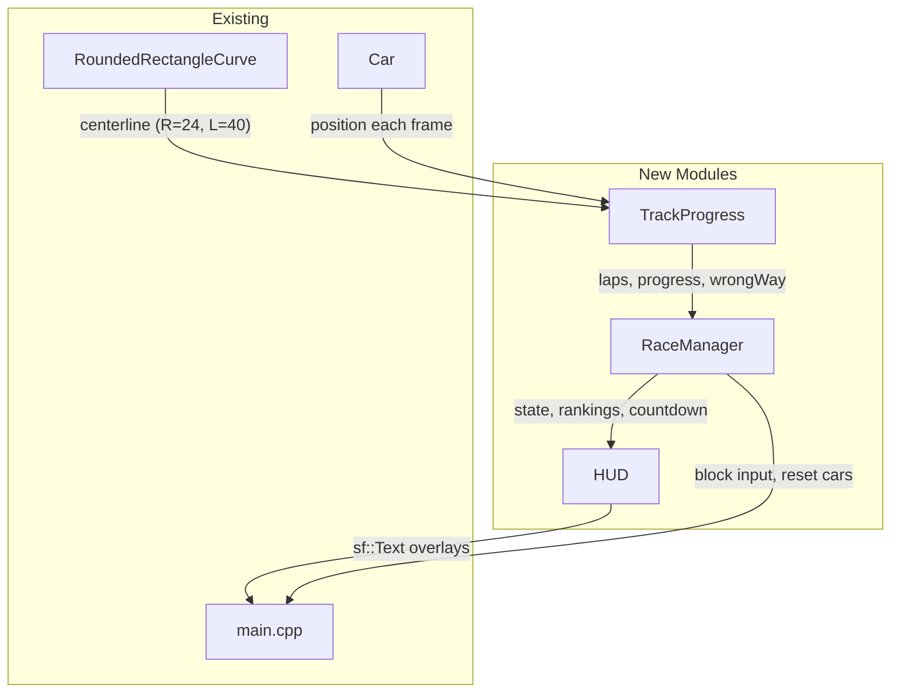
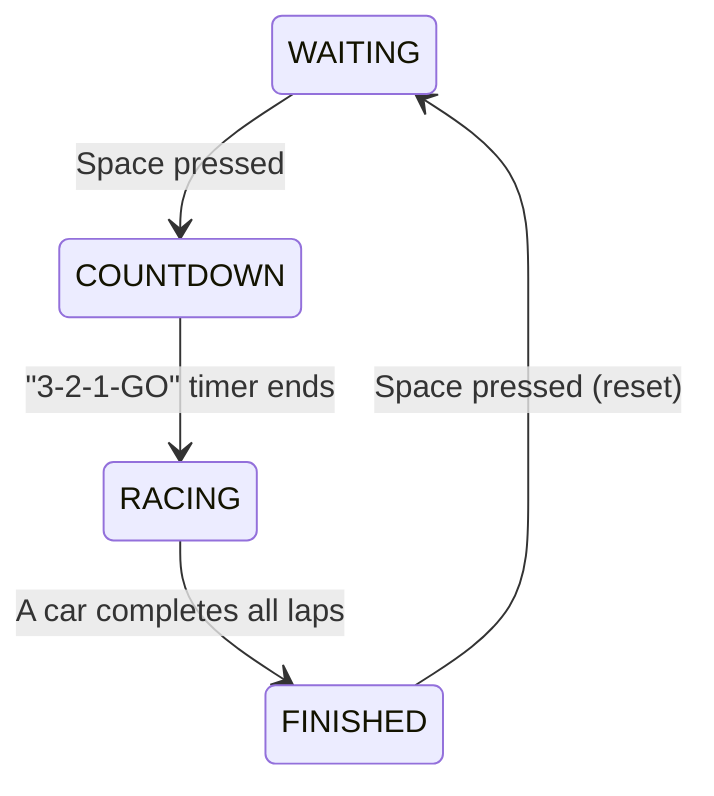

# Racing Game Logic Implementation

## Architecture

The track is a rounded rectangle parameterized by theta (0-360 degrees), where increasing theta = counterclockwise movement. A **centerline curve** (average of inner/outer borders) provides the reference for progress tracking.




## Track Geometry

- Inner border: `RoundedRectangleCurve(20, 40)`, outer: `RoundedRectangleCurve(28, 40)`
- **Centerline**: `RoundedRectangleCurve(24, 40)` -- midpoint of inner/outer radii
- Start/finish line at theta=0: inner point `(40, 0)` to outer point `(48, 0)`
- Cars start on the track at theta=0, facing up `(0, 1)`:
  - Car 0 (keyboard, red): position `(42, 0)` (inner lane)
  - Car 1 (RL, blue): position `(46, 0)` (outer lane)

## New Files

### 1. `src/cpp/race/track_progress.h` / `.cpp`

Per-car tracking struct:

```cpp
struct CarProgress {
    double currentTheta;      // theta on centerline [0, 360)
    double previousTheta;
    int lapsCompleted;         // incremented when crossing start line with all checkpoints hit
    int nextCheckpoint;        // index into checkpoint array
    bool goingWrongWay;
    double totalProgress;      // lapsCompleted * 360 + currentTheta (for ranking)
};
```

Key logic:

- **Centerline**: `RoundedRectangleCurve(24, 40)` with 360 cached points
- **Progress update**: each frame, call `centerline.closestPointTo(carPosition)` to get `currentTheta`
- **Direction detection**:
  - `delta = currentTheta - previousTheta`
  - If `delta > 180` --> actually backward, adjust `delta -= 360`
  - If `delta < -180` --> actually forward, adjust `delta += 360`
  - `goingWrongWay = (delta < -threshold)` (small threshold to avoid jitter)
- **Checkpoints**: 8 checkpoints at theta = 0, 45, 90, ..., 315. Car must pass them in increasing order. A checkpoint is "passed" when car's theta crosses it in the forward direction.
- **Lap completion**: When car crosses theta=0 (start line) in forward direction AND `nextCheckpoint == 0` (all 8 checkpoints already passed), increment `lapsCompleted` and reset `nextCheckpoint`.

### 2. `src/cpp/race/race_manager.h` / `.cpp`

State machine:




Responsibilities:

- **WAITING**: Cars placed at start, inputs blocked, show "Press SPACE to start"
- **COUNTDOWN**: 4-second timer (3, 2, 1, GO! -- 1 sec each), inputs blocked
- **RACING**: Normal gameplay, TrackProgress updates, rankings computed
- **FINISHED**: Show winner, inputs blocked, Space to restart
- **Rankings**: Compare `totalProgress` of each car; car with higher value is P1
- **Reset**: Resets car positions/velocities, TrackProgress state, and race state to WAITING
- Hardcoded `TOTAL_LAPS = 3`

### 3. `src/cpp/race/hud.h` / `.cpp`

Text overlays using `sf::Font` + `sf::Text` (SFML 3 API). Font loaded from `random-documentation/arial.ttf`.

Displays:

- **Lap counter** (per car): "Lap 1/3" -- top-left for car 0, top-right for car 1
- **Position/ranking**: "P1" / "P2" near each car's lap counter
- **Countdown**: Large centered "3", "2", "1", "GO!"
- **Wrong way warning**: Large centered "WRONG WAY" in red when a car drives backward
- **Winner**: Large centered "Player X Wins!" when race finishes
- **Start prompt**: "Press SPACE to start" during WAITING state

## Modified Files

### 4. `[src/cpp/entity/car/car.h](src/cpp/entity/car/car.h)` / `[car.cpp](src/cpp/entity/car/car.cpp)`

Add a `reset()` method:

```cpp
void reset(Vector2D pos, Vector2D dir);
```

Resets `position`, `direction`, `speed = 0`, `tangentialAcceleration = 0`.

### 5. `[src/cpp/main.cpp](src/cpp/main.cpp)`

Changes:

- Create centerline curve, `TrackProgress`, `RaceManager`, `HUD` objects
- Set car colors: car 0 = red, car 1 = blue
- Draw start/finish line (white/checkered line from inner to outer border at theta=0)
- Handle `sf::Event::KeyPressed` for Space key to start/restart race
- **Gate car input**: only call `inputHandler->apply()` during RACING state
- **Update loop**: call `trackProgress.update()` and `raceManager.update()` each frame
- **Render**: call `hud.draw()` after existing render calls (before `window.display()`)
- **Reset episode** (lines 250-254): call `raceManager.reset()` which resets both cars via `car.reset()` and resets TrackProgress
- Move `window.display()` out of `render()` so HUD can draw after track/cars

## Wrong-Way Handling

Like real racing games:

- Cars CAN physically turn around (steering is not locked)
- If the car moves backward along the track (negative delta theta sustained), show "WRONG WAY" warning
- Checkpoints prevent cheating: driving backward and then forward won't count as lap progress because checkpoints must be hit in order
- Brief reversals (e.g., 3-point turns) are tolerated via a small threshold on delta

