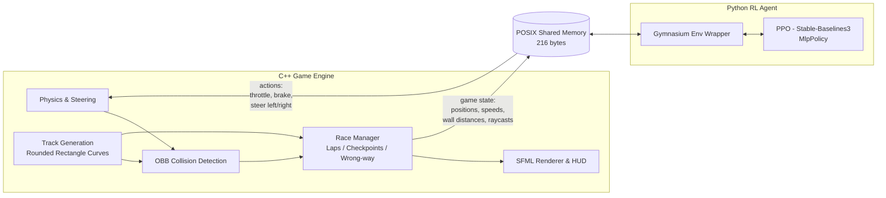
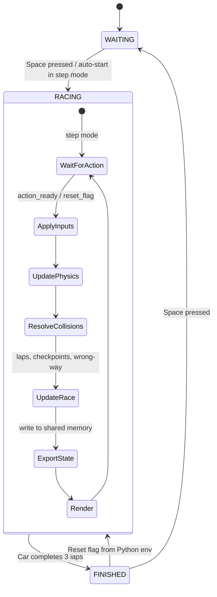

# 2d-racer-game-and-rl-agent

A 2D top-down racing game built from scratch in C++ with SFML, paired with a reinforcement learning agent trained via PPO to race autonomously. The game and the agent communicate through POSIX shared memory in a lock-step protocol.

General architecture (mermaid):





## C++ Game

A top-down 2D racer rendered with SFML at 60 FPS. Two cars race around a rounded-rectangle (stadium) track for 3 laps. Car 1 (red) is keyboard-controlled with arrow keys (or follows the centerline automatically during training). Car 2 (blue) is either WASD-controlled or driven by the RL agent over shared memory. The track has inner and outer walls, a start/finish line, 8 directional checkpoints, and wrong-way detection that respawns you at the last checkpoint.

## RL Concepts

### Markov Decision Process

An MDP frames the problem as an agent interacting with an environment in discrete timesteps: at each step the agent observes a state, picks an action, receives a reward, and transitions to a new state. The goal is to learn a policy that maximizes cumulative reward. All the methods below are different strategies for finding that policy.

### Policy-Based vs Value-Based Methods

Value-based methods learn a value function (\(V(s)\) or \(Q(s,a)\)) and derive a policy from it (e.g. epsilon-greedy). Policy-based methods learn the policy directly as a probability distribution \(\pi_\theta(s)\), typically using Monte Carlo sampling.


### Value Function & Bellman Equation

The value function \(V_\pi(s)\) gives the expected return starting from state \(s\) under policy \(\pi\). The Bellman equation expresses this recursively — the value of a state equals the immediate reward plus the discounted value of the next state — enabling dynamic programming instead of computing full rollouts.


### Q-Learning

Q-learning maintains a table \(Q(s,a)\) representing the expected future reward for taking action \(a\) in state \(s\). It updates off-policy using: \(Q(s,a) \leftarrow Q(s,a) + \alpha[r + \gamma \max_{a'} Q(s',a') - Q(s,a)]\).


### Deep Q-Network (DQN)

DQN replaces the Q-table with a neural network to handle large/continuous state spaces. Key improvements over naive deep Q-learning: a **replay buffer** for stable i.i.d. training samples, and a **target network** (frozen copy updated every N steps) to prevent moving-target instability.


### Policy Gradient Methods

Instead of learning values, policy gradient methods directly parameterize the policy \(\pi_\theta(a|s)\) and optimize it by gradient ascent on expected return. The policy gradient theorem gives: \(\nabla_\theta J(\theta) = \mathbb{E}[\nabla_\theta \log \pi_\theta(a|s) \cdot R(\tau)]\), estimated from sampled trajectories.


### Proximal Policy Optimization (PPO)

PPO improves on vanilla policy gradients by preventing destructively large updates. It introduces an **advantage function** \(A(s,a) = G - V(s)\) (was this action better than expected?) and clips the probability ratio \(r(\theta) = \pi_\theta / \pi_{\theta_{old}}\) to \([1-\varepsilon, 1+\varepsilon]\), taking the min of the clipped and unclipped objective. This is the algorithm used to train the agent in this project.


## How to Run

**Prerequisites:** SFML 3, CMake, Python 3 with a virtual environment, and a Linux environment (or WSL) for POSIX shared memory.

### Build & run the game

```bash
cmake -S . -B build/
cmake --build build/
./build/racer
```

### Train the RL agent

Start the game first with `externalInputMode = true` and `stepMode = true` in `src/cpp/main.cpp`, then:

```bash
cd src/python
source venv/bin/activate
python train.py --timesteps 500000
```

Monitor training with TensorBoard:

```bash
tensorboard --logdir src/python/runs/
```

### Run a trained model

```bash
cd src/python
source venv/bin/activate
python play.py --model models/checkpoints/racer_ppo_300000_steps
```
