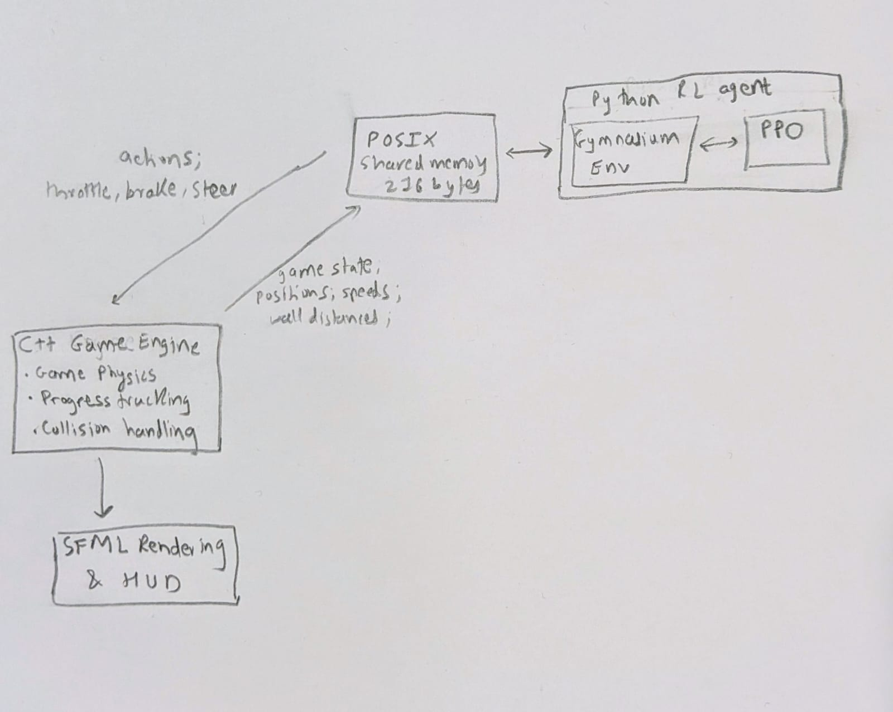
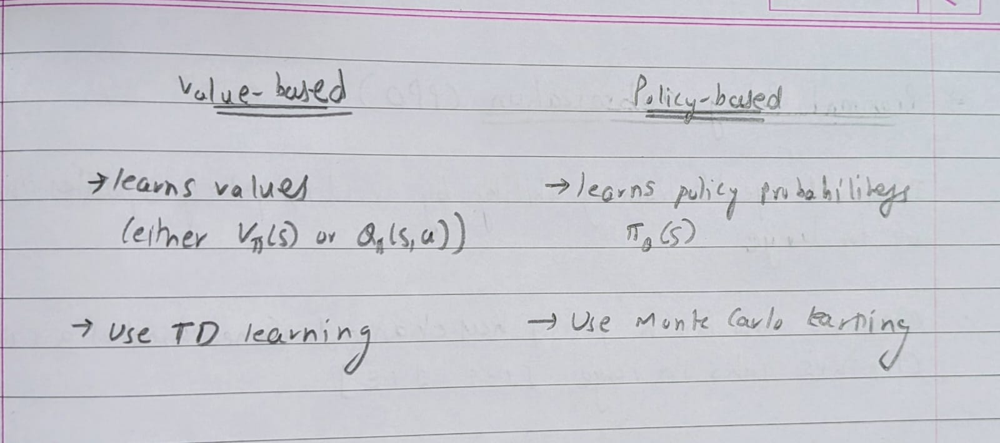
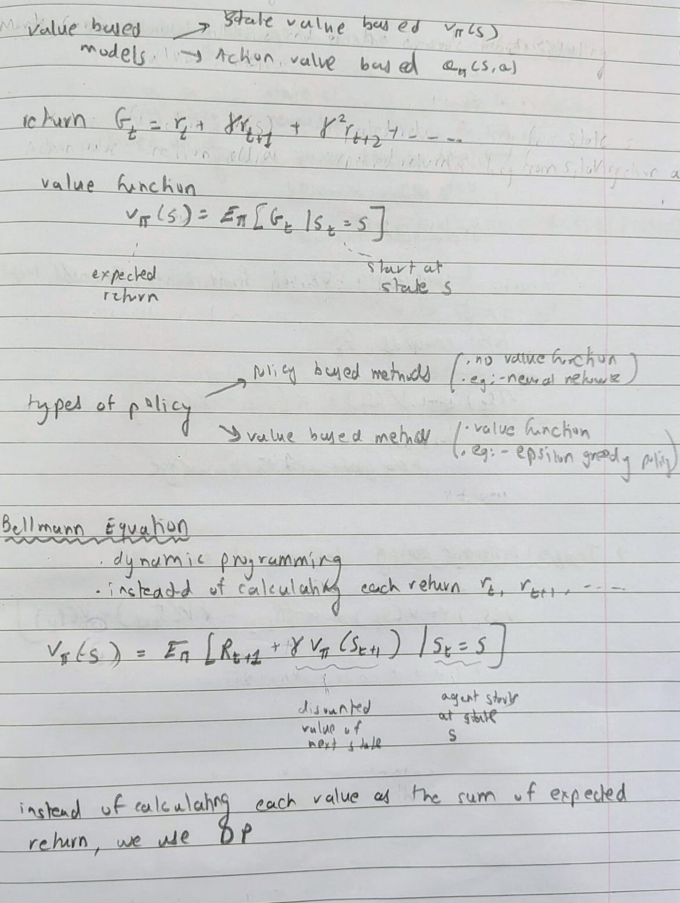
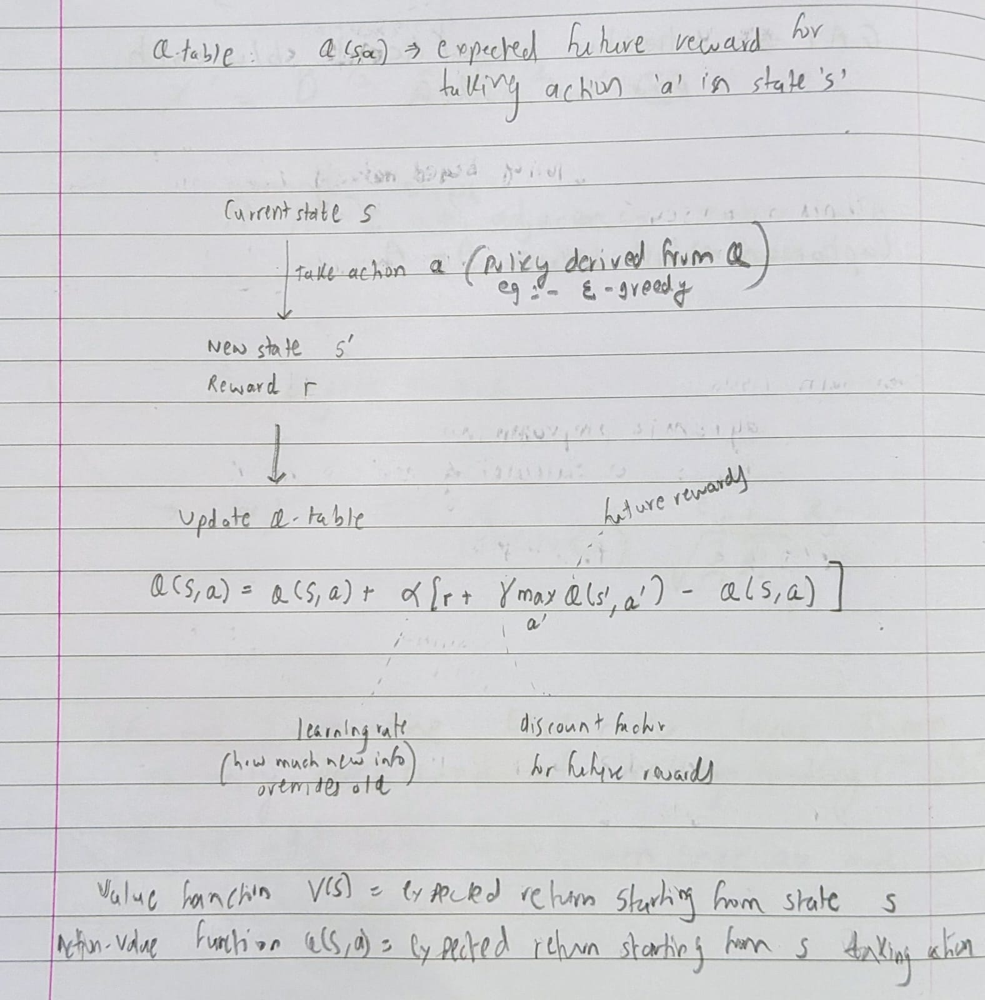
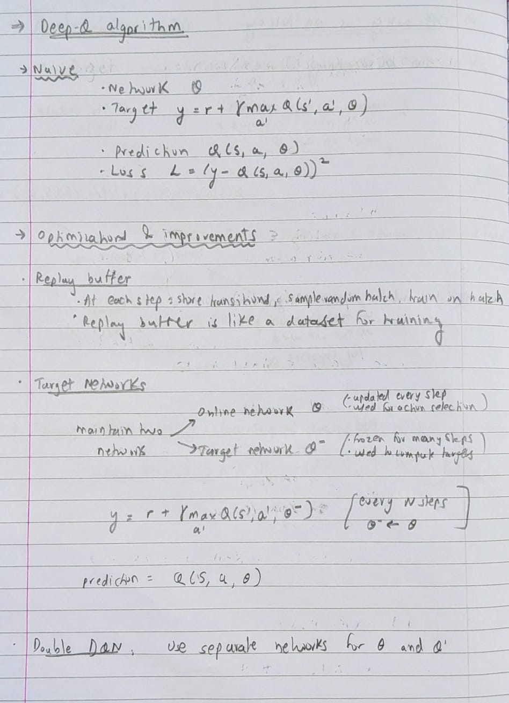
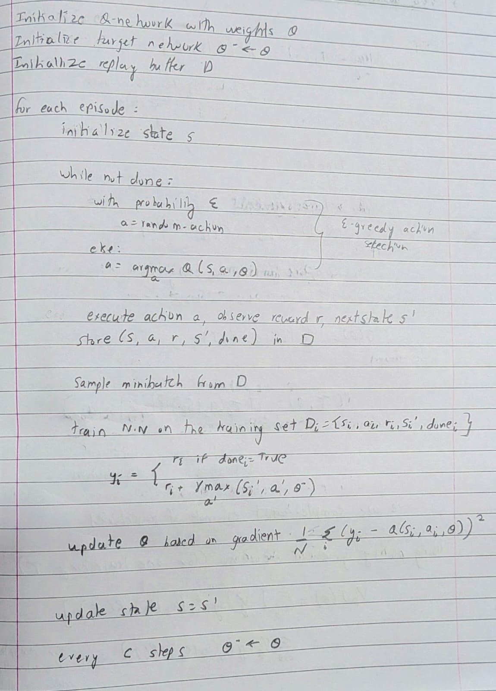
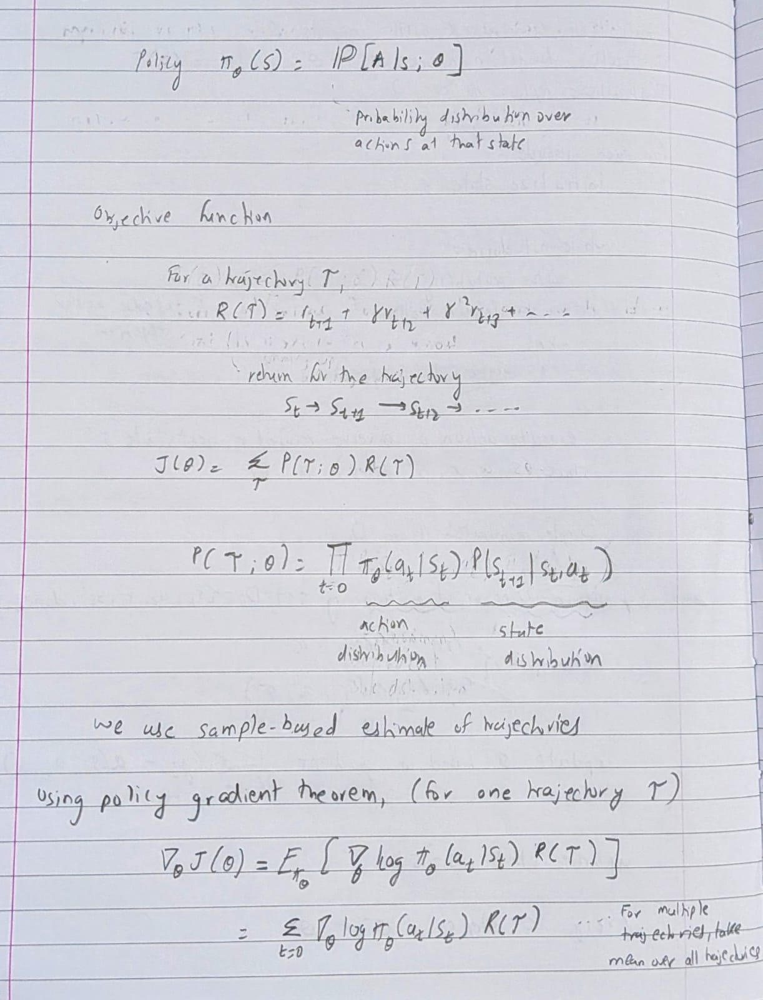
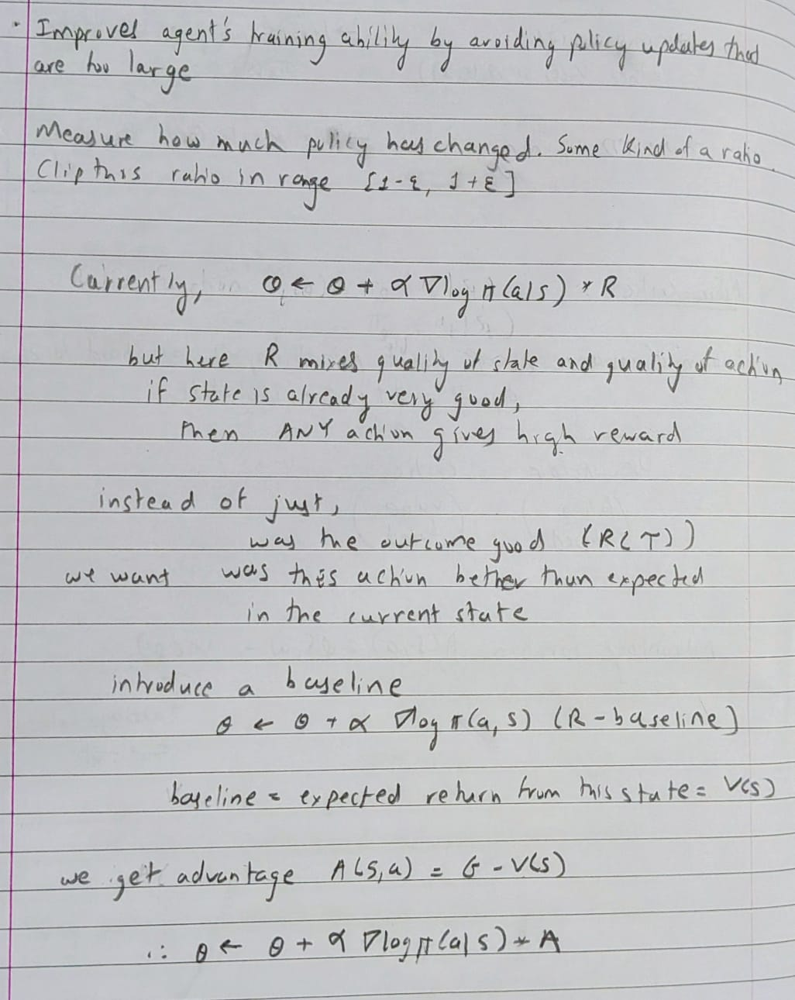
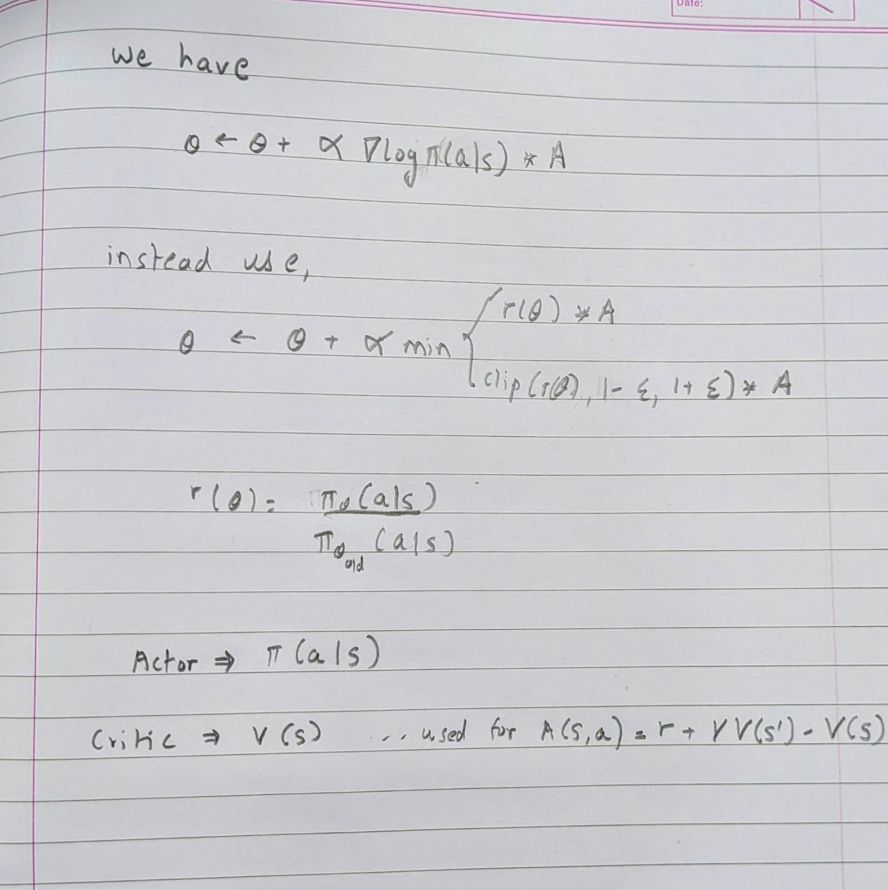

# 2d-racer-game-and-rl-agent

A 2D top-down racing game built from scratch in C++ with SFML, paired with a reinforcement learning agent trained via PPO to race autonomously. The game and the agent communicate through POSIX shared memory in a lock-step protocol.

General architecture:



## C++ Game

A top-down 2D racer rendered with SFML at 60 FPS. Two cars race around a rounded-rectangle (stadium) track for 3 laps. Car 1 (red) is keyboard-controlled with arrow keys (or follows the centerline automatically during training). Car 2 (blue) is either WASD-controlled or driven by the RL agent over shared memory. The track has inner and outer walls, a start/finish line, 8 directional checkpoints, and wrong-way detection that respawns you at the last checkpoint.

## RL Concepts

### Markov Decision Process

An MDP frames the problem as an agent interacting with an environment in discrete timesteps: at each step the agent observes a state, picks an action, receives a reward, and transitions to a new state. The goal is to learn a policy that maximizes cumulative reward. All the methods below are different strategies for finding that policy.

### Policy-Based vs Value-Based Methods

Value-based methods learn a value function and derive a policy from it (e.g. epsilon-greedy). Policy-based methods learn the policy directly as a probability distribution, typically using Monte Carlo sampling.



### Value Function & Bellman Equation

The value function gives the expected return starting from state under the policy. The Bellman equation expresses this recursively — the value of a state equals the immediate reward plus the discounted value of the next state — enabling dynamic programming instead of computing full rollouts.



### Q-Learning

Q-learning maintains a table representing the expected future reward for taking action in state.



### Deep Q-Network (DQN)

DQN replaces the Q-table with a neural network to handle large/continuous state spaces. Key improvements over naive deep Q-learning: a **replay buffer** for stable i.i.d. training samples, and a **target network** (frozen copy updated every N steps) to prevent moving-target instability.




### Policy Gradient Methods

Instead of learning values, policy gradient methods directly parameterize the polic and optimize it by gradient ascent on expected return. 



### Proximal Policy Optimization (PPO)

PPO improves on vanilla policy gradients by preventing destructively large updates. 




## How to Run

**Prerequisites:** SFML 3, CMake, Python 3 with a virtual environment, and a Linux environment (or WSL) for POSIX shared memory.

### Build & run the game

```bash
cmake -S . -B build/
cmake --build build/
./build/racer
```

### Train the RL agent

Start the game first with `externalInputMode = true` and `stepMode = true` in `src/cpp/main.cpp`, then:

```bash
cd src/python
source venv/bin/activate
python train.py --timesteps 500000
```

Monitor training with TensorBoard:

```bash
tensorboard --logdir src/python/runs/
```

### Run a trained model

```bash
cd src/python
source venv/bin/activate
python play.py --model models/checkpoints/racer_ppo_300000_steps
```
